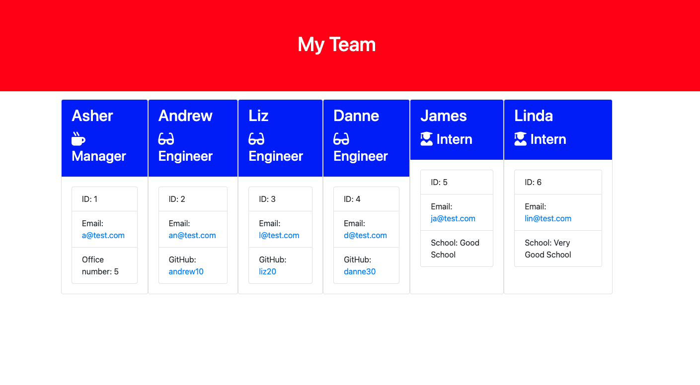

# Team Profile Generator


## Description

 This application will take in information about employees on a software engineering team, then generates an HTML webpage that displays summaries for each person. 
 It displays a basic info so that a user have quick access to their emails and GitHub profiles.

## Table of Contents
- [About](#about)
- [Installation](#installation)
- [Usage](#usage)
- [Tests](#tests)
- [Credits](#credits)
- [License](#license)

## About
The application use Inquirer to collect the team information.
Inquirer is an npm package for Node.js that provides a user-friendly interface for collecting information from a user through a command-line interface. 
The application use Async functions and JavaScript classes for each team member provided and export them. 

## Installation
* You should have node installed on you computer if you don't have it you can get it here [node](https://nodejs.org/en/).
* You should clone the repository from github using 
```
git clone https://github.com/Asherbeck10/Team-Profile-Generator.git

```
* after you cloned the repository run 
```
npm i
```
it will install the requires dependencies.

## Usage
* To start the application run 
```
node index.js
```
* It will prompt you to enter your details as a manger.


*  After you  enter those requirements then you will be is presented with a menu with the option to:


* When you select the **engineer** option then a you will be  prompted to enter the following and then you will be taken back to the option menu:


* When you select the **intern** option then a you will be  prompted to enter the following and then you will be taken back to the option menu:


* When a you decide to finish building your team then chose "Finish building the team" and a HTML is generated . The generated HTML is located in the `output` directory.


## Tests
* You can run tests checking the classes the tests are located in the `_test_` directory.use this command -line.
```
npm run test
```
* I used jest to render the tests.

## Credits
* [node](https://nodejs.org/en/)
* [inquirer](https://www.npmjs.com/package/inquirer)
* [jest](https://jestjs.io/)

## license
ISC License (ISC)

  
   


---


